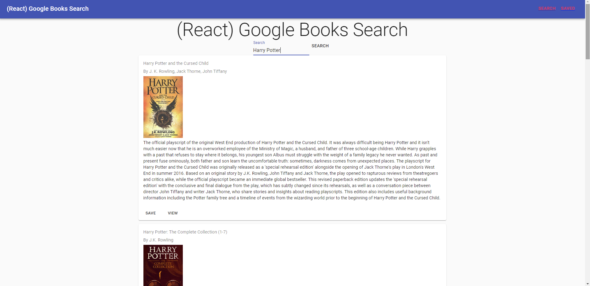

# Google Books Library

## Description

An application to query the Google Books API

# Table of Contents

* [Installation](#installation)
* [Usage](#usage)
* [License](#license)
* [Questions](#questions)

## INSTALLATION

Follow the link [here](https://evening-ravine-79529.herokuapp.com/).

## Usage

Enter the name of the book you would like to search for, and click "Save" to save the book for future reference. Clicking "Saved" in the navigation bar will lead you to a page containing all saved books. Clicking the "delete" button on any books will delete them from the database.

## License

This application is covered by the [MIT License](https://opensource.org/licenses/MIT)

Copyright 2020 artuis

## Contributing

none

## Tests

none

## Questions

GitHub: https://github.com/artuis/

Email: tommyan97@msn.com
